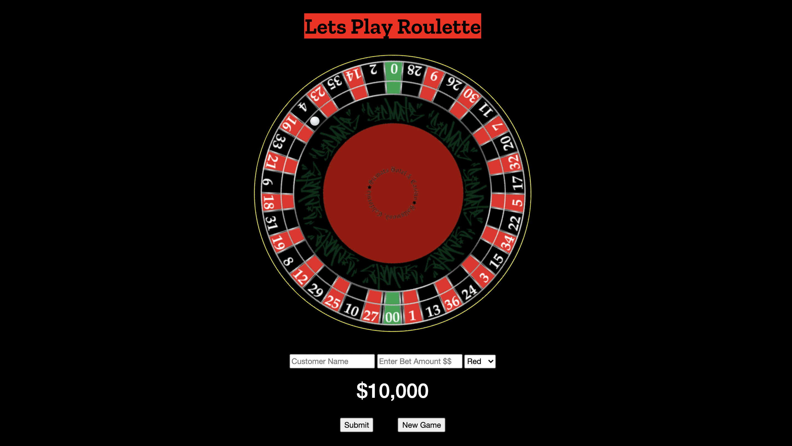
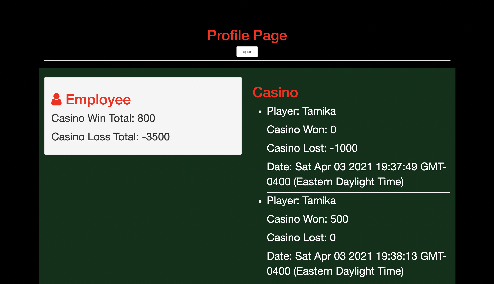

# Barista - FullStack Auth App

- I created a Roulette full stack app where the player can pick a number or color and place a bet. The casino dealer/employee can login to see the casinos financials that will list all the player rounds and keep track of what the casino has won and lost for the night.

[Checkout my portfollio to see live app](https://www.tamikasterlin.com)

## How its Made:
### Tech Used:

- HTML, CSS, JavaScript, Express, Node.js, MongoDB

## Lessons Learned

- I learned how to use express and node.js to get my app running server side and to create user authentication. I also learned how to create a database using MondoDB and with that, I was able to practice using CRUD and rest api's.

## Other Projects

[Movie Quotes App - Express](https://github.com/TamikaSterlin/Personal-Express---Movie-Quotes)

[To Do List express](https://express-previous-todo.herokuapp.com/)
